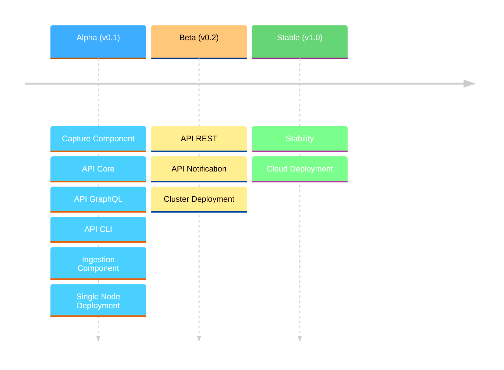

# 🔥 Welcome to [FusionState](https://fusionstate.io)

## ✨ Our Mission
We build the future of distributed data integration. Our mission is to become the industry standard for decoupled data access in event-driven distributed systems, enabling seamless, scalable, and efficient data sharing across teams.

## 📌 Roadmap
We have big plans and welcome any contribution to our mission. FusionState will be developed in 3 stages: Alpha, Beta and Stable. The project will be developed as Open Source software once we reach the Alpha stage (v0.1).

